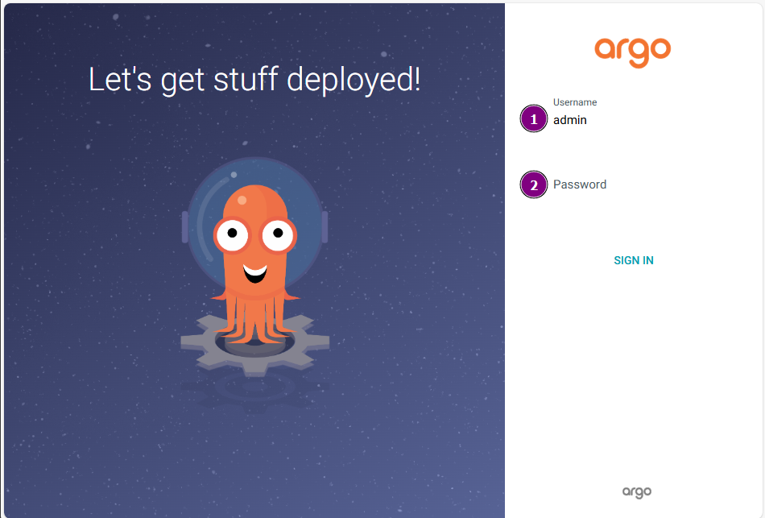
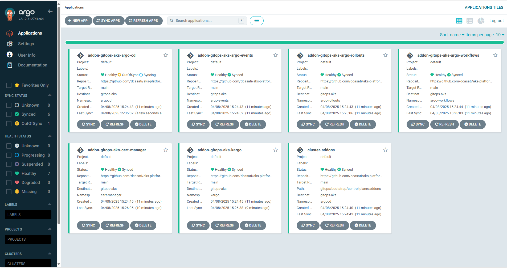

# Building a Platform Engineering Environment on Azure Kubernetes Service (AKS)

Welcome to the **Platform Engineering on AKS** workshop. This hands-on workshop will guide you through implementing a robust platform engineering environment using the Cloud Native pattern on Azure Kubernetes Service (AKS). The environment leverages GitOps practices and integrates tools such as [ArgoCD](https://argo-cd.readthedocs.io/en/stable/), [Terraform](https://www.terraform.io/), and the [Cluster API Provider for Azure (CAPZ)](https://github.com/kubernetes-sigs/cluster-api-provider-azure) along with [Azure Service Operator (ASO)](https://azure.github.io/azure-service-operator/). By the end of this workshop, participants will be able to deploy infrastructure and application environments using these tools.

## Workshop Goals

- Provide a foundational understanding of key tools in the platform engineering space
- Build a control plane AKS cluster using Terraform
- Bootstrap GitOps with ArgoCD
- Demonstrate how CAPZ and ASO can provision infrastructure and Kubernetes clusters
- Show how to deploy application environments on both existing AKS clusters and newly created dedicated clusters

## Architecture Overview

This workshop uses the [GitOps Bridge Pattern](https://github.com/gitops-bridge-dev/gitops-bridge?tab=readme-ov-file) as a foundation:


- A control plane cluster is provisioned and bootstrapped with ArgoCD
- Terraform manages AKS and core infrastructure
- ArgoCD syncs platform addons via GitOps
- Cluster API Provider for Azure (CAPZ) is used for managing additional clusters

> Note
> CAPZ or Crossplane? Before deploying this solution, take time to evaluate which control plane best fits your organization's needs. In this workshop, we’ll focus on CAPZ and ASO, but Crossplane is another viable option. To help you decide, we've outlined the key differences between them in this guide [how to choose your control plane provider](./capz-or-crossplane.md).

## Prerequisites

- Azure Subscription
- [Azure CLI](https://learn.microsoft.com/en-us/cli/azure/) version 2.60.0 or later
- [Terraform](https://www.terraform.io/) v1.8.3 or later*
- [kubectl](https://kubernetes.io/docs/tasks/tools/) version 1.28.9 or later

> Note
> Authenticate Terraform as described in the [Azure Terraform authentication guide](https://learn.microsoft.com/azure/developer/terraform/authenticate-to-azure?tabs=bash).


## Getting Started

### 1. Fork the Repository

If you don’t need the repository to be private, simply **fork it** and proceed—no extra setup is needed.

#### 1.a Using a Private Repository 

If however you do need the repository to be private:

- Add a [deploy SSH key](https://docs.github.com/en/authentication/connecting-to-github-with-ssh/managing-deploy-keys#deploy-keys)
- Place the private key as `terraform/private_ssh_deploy_key`
- Modify the `gitops_addons_org` variable to use SSH format (`git@github.com:`)
- Uncomment line 489 in `terraform/main.tf`

### 2. Initialize Terraform

```bash
cd terraform
terraform init -upgrade
```

### 3. Apply Terraform

You can either pass variables directly via the CLI or use a `.tfvars` file.

Option 1: Apply with CLI arguments

```bash
terraform apply -var gitops_addons_org=https://github.com/<your-org> --auto-approve
```

Option 2: Use a `terraform.tfvars` file

Rename the sample file below to `terraform.tfvars` and update the values as needed. Terraform will automatically load it:

```bash
mv sample.tfvars terraform.tfvars
terraform apply --auto-approve
```

Terraform will provision the AKS control plane cluster, install Argo CD, and bootstrap the initial addon infrastructure using GitOps.

Sample `terraform.tfvars`

```terraform
# Azure region
location = "westus3"

# Kubernetes version
kubernetes_version = null # Defaults to latest

# GitOps Addons configuration
gitops_addons_org      = "https://github.com/dcasati"
gitops_addons_repo     = "aks-platform-engineering"
gitops_addons_basepath = "gitops/"
gitops_addons_path     = "bootstrap/control-plane/addons"
gitops_addons_revision = "main"

# Agents size
agents_size = "Standard_D2s_v3"

# Addons configuration
addons = {
  enable_kyverno = false
}

# Resource group name
resource_group_name = "aks-gitops"
```

## Access ArgoCD UI

### 1. Export kubeconfig

```bash
export KUBECONFIG=$(pwd)/kubeconfig
```

### 2. Retrieve ArgoCD admin password and server IP

Save the initial password for the argoCD UI:

```bash
kubectl get secrets argocd-initial-admin-secret -n argocd --template="{{index .data.password | base64decode}}"
kubectl get svc -n argocd argo-cd-argocd-server
```

If no public IP is available:

```bash
kubectl port-forward svc/argo-cd-argocd-server -n argocd 8080:443
```

Access the UI at [https://localhost:8080](https://localhost:8080). The default username is `admin` (1).



Click on `Applications` and verify that the statuses of the argoCD applications are `Healthy`.


---

## Install Cluster API Provider for Azure (CAPZ)

This section walks you through installing **Cluster API Provider for Azure (CAPZ)** and preparing your environment for provisioning AKS clusters using GitOps workflows.

### Prerequisites: Verify cert-manager

CAPZ requires `cert-manager`, which should already be installed by Argo CD. Confirm it's running:

```bash
kubectl get pods -n cert-manager
```

You should see all cert-manager pods in a `Running` state. If they are not yet ready, wait a few moments and try again.

### Install the Cluster API Operator

The Cluster API Operator helps manage the lifecycle of Cluster API components like CAPZ.

#### Step 1: Add and update the Helm repo

```bash
helm repo add capi-operator https://kubernetes-sigs.github.io/cluster-api-operator
helm repo update
```

#### Step 2: Install the operator with Helm

Use the pre-configured values file from your GitOps repo to install the operator:

```bash
helm install capi-operator capi-operator/cluster-api-operator \
  --create-namespace -n capi-operator-system \
  --wait --timeout 300s \
  -f ../gitops/environments/default/addons/cluster-api-provider-azure/values.yaml
```

This will install the operator in its own namespace and apply CAPZ-specific settings. You should see an output similar to this:

```bash
NAME: capi-operator
LAST DEPLOYED: Tue Apr  8 15:43:05 2025
NAMESPACE: capi-operator-system
STATUS: deployed
REVISION: 1
TEST SUITE: None
```

### Verify the CAPZ Installation

Check the status of the pods in the `azure-infrastructure-system` namespace:

```bash
kubectl get pods -n azure-infrastructure-system
```

You should expect to see output like:

```
azureserviceoperator-controller-manager-xxxxx   1/1   Running
capz-controller-manager-xxxxx                   1/1   Running
```

If pods are not running, check logs or use `kubectl describe` for troubleshooting.

### Apply Workload Identity Credentials for CAPZ

To allow CAPZ to create and manage Azure resources, you'll need to apply workload identity credentials using values generated by Terraform.

#### Step 1: Generate the identity configuration file

Use the following command to generate a new identity configuration file (`gitops/hooks/identity/identity.generated.yaml`) using values from your Terraform outputs:

```bash
client_id=$(terraform output -raw akspe_client_id)
tenant_id=$(terraform output -raw tenant)

cat <<EOF > ../gitops/hooks/identity/identity.generated.yaml
apiVersion: infrastructure.cluster.x-k8s.io/v1beta1
kind: AzureClusterIdentity
metadata:
  annotations:
    argocd.argoproj.io/hook: PostSync
    argocd.argoproj.io/sync-wave: "5"
    argocd.argoproj.io/sync-options: SkipDryRunOnMissingResource=true
  labels:
    clusterctl.cluster.x-k8s.io/move-hierarchy: "true"
  name: cluster-identity
  namespace: azure-infrastructure-system
spec:
  allowedNamespaces: {}
  clientID: \${client_id}
  tenantID: \${tenant_id}
  type: WorkloadIdentity
EOF
```

This approach leaves the original identity.yaml untouched and ensures values are inserted accurately.

#### Step 2: Apply the generated configuration

Once the file is generated, apply it to your cluster:

```bash
kubectl apply -f ../gitops/hooks/identity/identity.generated.yaml
```

This completes the identity setup for CAPZ using your Terraform-managed credentials.

## Summary

Here's what you’ve accomplished so far:

- Terraform provisioned the AKS control plane cluster and downloaded the kubeconfig
- Argo CD was installed and configured via Terraform
- An Argo CD ApplicationSet is syncing the contents of `gitops/bootstrap/control-plane/addons` using the App of Apps pattern
- CAPZ and ASO were manually installed to support infrastructure provisioning for development teams
- The environment is now ready to provision additional AKS clusters and deploy workloads using GitOps workflows

## Next Steps

With the management cluster ready, the next step is to learn how to [onboard a development team](./docs/Onboard-New-Dev-Team.md).